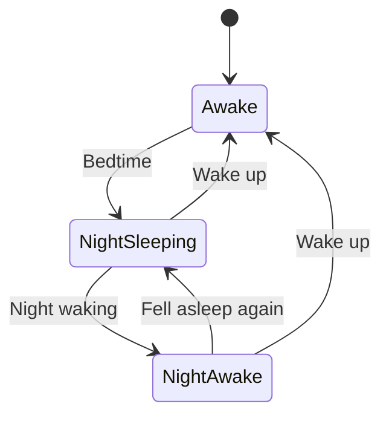
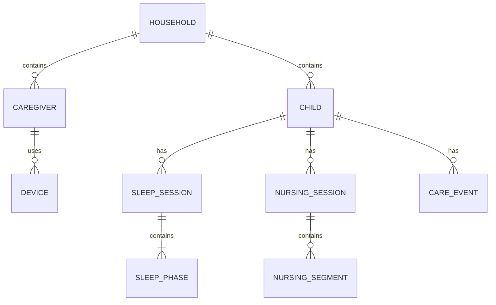
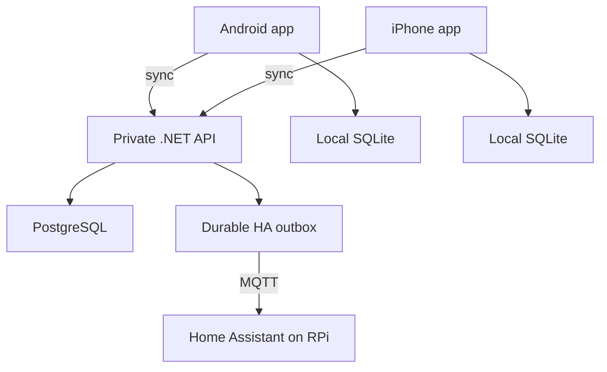

# Arthur Tracker

## MVP product and technical specification

Status: build-ready  
Date: 2026-08-07  
Audience: Gustavo, Paloma, and implementation agents

## 1. Product intent

Arthur Tracker is a private, shared Android and iPhone application for recording Arthur's daily care with as little friction as possible. It replaces the parts of Napper that Gustavo and Paloma currently use, while adding reliable Home Assistant automation.

This is an original product inspired by the usability principles observed in Napper. It must not copy Napper's branding, illustrations, sounds, written content, or pixel-level interface.

### Success statement

Gustavo or Paloma can record a normal care activity one-handed in a few seconds, see the same state on both phones, continue while offline, and safely drive household automations when Arthur sleeps or wakes.

### Product principles

1. **One-handed and immediate.** The most common action starts in one tap from the home screen.
2. **Local-first.** A slow or unavailable network never blocks recording an activity.
3. **Shared truth.** Both caregivers converge on the same history and active timers.
4. **No silent data loss.** Genuine conflicts require a visible, understandable outcome.
5. **Automation is downstream.** The tracker owns care history; Home Assistant consumes live state and events.
6. **Paloma needs no technical maintenance.** Pairing and daily operation must feel like a normal consumer app.
7. **Private by default.** Only paired household devices can access Arthur's data.

## 2. Confirmed scope

### MVP

- One shared household and one child profile: Arthur.
- Android and iPhone apps from one React Native/Expo TypeScript codebase.
- Nap timers.
- Night sessions composed of sleeping and temporarily-awake phases.
- Night waking and “fell asleep again” transitions.
- Final morning wake-up that ends the night session.
- Nursing session with independent left/right timers, switching, and pausing.
- Diapers categorized as dry, wet, dirty, or mixed.
- Medicine recorded as a timestamp plus unrestricted text note.
- Radial daily timeline.
- Chronological daily history.
- Create, edit, delete, and undo.
- Offline-first local persistence.
- Synchronization between both phones.
- Explicit activity-conflict resolution.
- Home Assistant live sleep state and sleep/wake events.
- Export and recoverable backups.

### Nice to have, permitted only if it does not delay MVP

- Bath as a timestamped event with an optional note.

### Explicitly out of scope

- Sleep prediction or wake-window recommendations.
- Sleep sounds.
- Developmental content or comparisons.
- Medicine-dose recommendations.
- Medicine reminders.
- Existing Napper-history import.
- Advanced statistics and charts.
- Public multi-family signup and billing.
- Smartwatch, lock-screen, or home-screen widgets.
- General-purpose baby-health advice.

## 3. Core concepts and terminology

| Concept | Meaning |
| --- | --- |
| Household | The private shared space used by Gustavo and Paloma. |
| Caregiver | A paired household member and their device. |
| Sleep session | A nap or an overall nighttime session. |
| Sleep phase | A sleeping or awake interval inside a sleep session. |
| Active timer | A sleep, night waking, or nursing activity that has not ended. |
| Point event | A diaper, medicine, or bath record occurring at a timestamp. |
| Local operation | A create/update/delete action recorded immediately on a phone. |
| Sync conflict | A local operation that cannot be safely applied because shared state changed elsewhere. |

## 4. Interaction model

### 4.1 Home / Today

The home screen is a 24-hour radial timeline with an original visual design. It is the operational screen, not an analytics dashboard.

It contains:

- Selected date and previous/next day navigation.
- A radial timeline showing sleep phases and point events.
- A central status that prioritizes the current state:
  - “Sleeping · 38 min”
  - “Awake tonight · 12 min”
  - “Awake · last sleep ended 1 h 14 min ago”
- Large quick actions for Sleep, Nursing, Diaper, and Medicine.
- A persistent compact controller for every active timer.
- A secondary add menu containing all event types, including Bath when enabled.
- A switch to chronological history for the selected date.
- A small sync-status indicator only when offline, syncing, or attention is required.

The screen must not display prediction, a recommended nap time, or overdue-sleep warnings.

### 4.2 Bottom-sheet behavior

Quick actions open a bottom sheet without removing the timeline context.

Common rules:

- New events default to the current time.
- Time can be corrected before saving using minute adjustments or a full date/time picker.
- Saving gives immediate feedback and closes or minimizes the sheet.
- Closing an active activity sheet does not stop its timer.
- Editing uses the same controls as creation, pre-filled with the saved values.
- Destructive actions offer a short Undo window.

### 4.3 Nap flow

1. Tap Sleep.
2. Choose Nap when no night session is active; Nap is the default during the day.
3. The app immediately creates a locally active nap at the selected start time.
4. The active mini-controller shows elapsed time.
5. Tap Stop, review/correct the end time, and save.

A nap consists of one asleep phase. It cannot overlap another nap or an active night session.

### 4.4 Night flow

The night is one session containing alternating phases; it is not represented as several unrelated sleep records.



Rules:

- Bedtime begins a night session and its first asleep phase.
- Night waking ends the current asleep phase and starts an awake phase, while the night session stays active.
- Fell asleep again ends the awake phase and starts another asleep phase.
- Wake up ends the current phase and the overall night session.
- The app must distinguish `night session active` from `currently sleeping`.
- If Wake up is tapped while the current phase is awake, no artificial sleeping phase is created.

### 4.5 Nursing flow

1. Tap Nursing.
2. Tap Left or Right to begin that side.
3. Switching sides closes the current segment and begins the other at the same effective time.
4. Pause closes the active side segment but keeps the nursing session open.
5. Resume begins a new segment on the selected side.
6. Finish ends the overall session.

The sheet shows session duration, left total, and right total. A nursing session may overlap sleep and point events. At most one side runs at a time.

### 4.6 Diaper flow

1. Tap Diaper.
2. Select exactly one category: Dry, Wet, Dirty, or Mixed.
3. Keep the default timestamp or correct it.
4. Save.

The category buttons must be large enough for one-handed operation. A note is not required for MVP.

### 4.7 Medicine flow

1. Tap Medicine.
2. Enter unrestricted text, for example `Paracetamol 2.5 ml`.
3. Keep the default timestamp or correct it.
4. Save.

The app stores what the caregiver entered. It never calculates, validates, suggests, or recommends a dose.

### 4.8 Chronological history

The selected day's list displays sleep phases, nursing sessions, diapers, medicines, and baths in time order. Each item shows its author and sync state only when useful.

Tapping an item opens details and editing. Cross-midnight night sessions appear on both relevant dates but retain one canonical identity.

## 5. Pairing and access

MVP does not need general-purpose email/password accounts.

1. The first installation creates the household through a one-time server bootstrap secret.
2. The server registers that device and returns a revocable device credential.
3. The first caregiver chooses “Invite caregiver.”
4. The app displays a short-lived single-use QR code and equivalent text code.
5. The second phone scans or enters it and chooses the caregiver display name.
6. The server issues a separate device credential stored in iOS Keychain or Android Keystore.

Properties:

- Invite expires after 15 minutes or immediately after use.
- Device credentials can be revoked independently.
- Pairing never exposes the server bootstrap secret.
- Every mutation records the caregiver and device that produced it.
- A future public product must replace this flow with standard user authentication; that is not an MVP concern.

## 6. Data model

All identifiers are client-generated UUIDv7 values so offline operations can be created without server coordination. All persisted timestamps are UTC instants; the originating IANA timezone is also recorded for correct day grouping and daylight-saving behavior.

### 6.1 Primary entities



### 6.2 Entity fields

#### Household

- `id`
- `name`
- `created_at`

#### Caregiver

- `id`
- `household_id`
- `display_name`
- `created_at`
- `revoked_at?`

#### Device

- `id`
- `caregiver_id`
- `name`
- `platform`: `android | ios`
- `credential_hash`
- `last_seen_at?`
- `revoked_at?`

#### Child

- `id`
- `household_id`
- `display_name`
- `timezone`
- `created_at`

#### SleepSession

- `id`
- `child_id`
- `kind`: `nap | night`
- `started_at`
- `ended_at?`
- `status`: `active | completed`
- `created_by`
- `updated_by`
- `version`
- `deleted_at?`

#### SleepPhase

- `id`
- `sleep_session_id`
- `kind`: `asleep | awake`
- `started_at`
- `ended_at?`
- `created_by`
- `updated_by`
- `version`
- `deleted_at?`

#### NursingSession

- `id`
- `child_id`
- `started_at`
- `ended_at?`
- `status`: `active | paused | completed`
- `created_by`
- `updated_by`
- `version`
- `deleted_at?`

#### NursingSegment

- `id`
- `nursing_session_id`
- `side`: `left | right`
- `started_at`
- `ended_at?`
- `version`
- `deleted_at?`

#### CareEvent

- `id`
- `child_id`
- `kind`: `diaper | medicine | bath`
- `occurred_at`
- `data`:
  - diaper: `{ category: dry | wet | dirty | mixed }`
  - medicine: `{ note: string }`
  - bath: `{ note?: string }`
- `created_by`
- `updated_by`
- `version`
- `deleted_at?`

### 6.3 Integrity rules

- A child has at most one active sleep session.
- An active sleep session has exactly one open phase.
- Night phases alternate asleep/awake and may not overlap.
- A nap has exactly one asleep phase and no awake phase.
- A child has at most one active nursing session.
- A nursing session has at most one open segment.
- Point events may overlap any interval.
- Deleted records become tombstones and remain in the change feed until every active device has synchronized past them.
- All interval ends must be later than or equal to their starts.
- A completed session has no open child segment or phase.

## 7. Synchronization

### 7.1 Local-first write path

Every user action is one atomic local transaction:

1. Update the local read model.
2. Append an operation to the local outbox.
3. Update the UI immediately.
4. Attempt background synchronization.

An operation contains:

- `operation_id` UUIDv7, used as the idempotency key.
- `entity_id`.
- `entity_type`.
- `action`: create/update/delete/transition.
- `base_version` for updates and deletes.
- Payload.
- Client timestamp and timezone.
- Caregiver and device identity.

The server stores each applied `operation_id`; retries return the original result and never duplicate an activity.

### 7.2 Incremental pull

- The server assigns a monotonic household change sequence after every committed mutation.
- Each device keeps `last_applied_sequence`.
- Pull requests return ordered changes after that cursor, including tombstones.
- Applying a batch and advancing the local cursor is one local transaction.
- Realtime notifications may prompt an immediate pull, but correctness never depends on realtime delivery.

### 7.3 Optimistic concurrency

- Every mutable aggregate has an integer `version`.
- Update and delete operations include `base_version`.
- If it matches, the server commits and increments the version.
- If it does not match, the server returns the canonical entity and classifies the conflict.
- The client never silently overwrites a newer version.

### 7.4 Conflict classes and rules

| Conflict | Rule |
| --- | --- |
| Same operation retried | Return the stored result; no duplicate. |
| Both phones start the same mutually exclusive activity | Accept the first committed start; mark the other local operation `needs_resolution`. |
| Start conflicts with a different active sleep state | Show the canonical active activity and require resolution. |
| One phone stops an activity already stopped by the other at effectively the same time | Treat as compatible when end times differ by at most 60 seconds; keep the server value and let the user edit afterward. |
| Both phones edit the same saved record differently | Keep the canonical server version and show a field-level comparison; user chooses Keep shared, Use mine, or Edit mine. |
| Edit versus delete | Deletion wins provisionally; offer Restore with the local edits applied as a new version. |
| Offline create overlaps later server state | Keep it locally visible as unresolved; do not publish it to Home Assistant until resolved. |

For duplicate starts, the conflict sheet says who started the existing activity and when. Actions are:

- **Keep shared; discard mine**
- **Replace shared with mine**
- **Adjust my time**

No conflict should use technical words such as version, record, server, or optimistic concurrency in caregiver-facing copy.

### 7.5 Time semantics

- Server receipt time never replaces the caregiver-selected occurrence time.
- Running durations are calculated from persisted start instants, not accumulated timer ticks.
- Device-clock skew greater than five minutes produces a non-blocking warning and records both client and server time for diagnosis.
- Cross-midnight records are grouped using Arthur's configured timezone.

## 8. Architecture



### 8.1 Mobile

- React Native with Expo and TypeScript.
- Expo Router for navigation.
- SQLite as the local source used by the UI.
- A repository/application layer so screens never call the network directly.
- Platform secure storage for device credentials.
- Custom radial timeline implemented with React Native SVG/Skia after the vertical slice; the first slice may use a chronological view.
- Native development builds for final Android/iOS testing.

### 8.2 Server

- ASP.NET Core API, matching Gustavo's maintainable backend stack.
- PostgreSQL as canonical storage.
- One database transaction for operation application, change-feed append, and Home Assistant outbox append.
- A background worker publishes the HA outbox and retries safely.
- Containerized deployment on the 24/7 CachyOS PC.
- HTTPS exposure through the existing secure tunnel pattern; the service itself still authenticates every device request.
- Health, readiness, structured logs, and database-migration checks.

### 8.3 Availability behavior

- If the PC, database, tunnel, internet, or Home Assistant is unavailable, both apps continue to record locally.
- When the API returns, apps synchronize and resolve any conflicts.
- If Home Assistant is unavailable, the API retains its outbox and publishes current retained state plus pending events after reconnection.
- The Raspberry Pi is not the primary care-history database.
- No automation depends on a particular caregiver phone.

### 8.4 API and sync surface

The mobile application uses a small versioned JSON API. Mutations are expressed as operations rather than screen-specific commands so that offline replay uses the same path as online use.

| Method and route | Purpose |
| --- | --- |
| `POST /v1/bootstrap` | Register the first household/device using the deployment bootstrap secret. |
| `POST /v1/invites` | Create a short-lived single-use caregiver invitation. |
| `POST /v1/pair` | Redeem an invitation and issue a device credential. |
| `POST /v1/sync` | Push an ordered operation batch and pull canonical changes after a cursor. |
| `GET /v1/snapshot` | Recover a complete household snapshot when no valid cursor exists. |
| `POST /v1/exports` | Produce a portable household export. |
| `GET /health/live` | Confirm the API process is alive. |
| `GET /health/ready` | Confirm database, migrations, and required dependencies are ready. |

Representative sync request:

```json
{
  "protocolVersion": 1,
  "deviceId": "<uuid>",
  "afterSequence": 181,
  "operations": [
    {
      "operationId": "<uuid-v7>",
      "entityType": "sleep_session",
      "entityId": "<uuid-v7>",
      "action": "start_nap",
      "baseVersion": null,
      "clientOccurredAt": "2026-08-07T13:11:00Z",
      "clientTimezone": "Europe/Lisbon",
      "payload": {}
    }
  ]
}
```

Representative response shape:

```json
{
  "accepted": [
    {
      "operationId": "<uuid-v7>",
      "entityId": "<uuid-v7>",
      "version": 1,
      "sequence": 182
    }
  ],
  "conflicts": [],
  "changes": [],
  "nextSequence": 182,
  "hasMore": false,
  "serverTime": "2026-08-07T13:11:02Z"
}
```

Conflict responses use the same successful HTTP response envelope when some operations in a batch are accepted and others need resolution. Transport/authentication errors use conventional HTTP status codes. Each conflict includes a stable conflict ID, classification, rejected local operation, canonical aggregate, and allowed resolution actions. This prevents a partially successful batch from being ambiguously retried.

Limits and ordering:

- At most 100 operations and 500 changes per sync call.
- Operations from one device are applied in submitted order.
- Each operation commits independently so one conflict does not block unrelated care records.
- The response always reports an outcome for every submitted operation.
- A snapshot includes active state, non-deleted history, retained tombstones needed by the device, and the sequence at which it was produced.

## 9. Home Assistant contract

MQTT is the primary integration because it supports retained state, availability, durable retry, and Home Assistant discovery.

### 9.1 Topics

| Topic | Retained | Purpose |
| --- | --- | --- |
| `lifeos/baby/arthur/availability` | Yes | API/bridge availability. |
| `lifeos/baby/arthur/state` | Yes | Complete current sleep state snapshot. |
| `lifeos/baby/arthur/events` | No | Transition events for automations and audit. |
| `homeassistant/.../config` | Yes | MQTT discovery definitions. |

Example retained state:

```json
{
  "schemaVersion": 1,
  "stateVersion": 184,
  "childId": "<uuid>",
  "sleeping": true,
  "nightSessionActive": true,
  "sleepKind": "night",
  "sessionId": "<uuid>",
  "phaseId": "<uuid>",
  "phaseStartedAt": "2026-08-07T20:43:00Z",
  "publishedAt": "2026-08-07T20:43:02Z"
}
```

Example transition event:

```json
{
  "schemaVersion": 1,
  "eventId": "<operation-uuid>",
  "stateVersion": 184,
  "type": "sleep_started",
  "childId": "<uuid>",
  "sessionId": "<uuid>",
  "occurredAt": "2026-08-07T20:43:00Z",
  "recordedBy": "Paloma"
}
```

### 9.2 Entities

- `binary_sensor.arthur_sleeping`
- `binary_sensor.arthur_night_session_active`
- `sensor.arthur_sleep_kind`
- `sensor.arthur_sleep_phase_started_at`
- `sensor.arthur_current_sleep_duration`
- `sensor.arthur_tracker_sync_status`

### 9.3 Events

- `sleep_started`
- `sleep_ended`
- `night_waking_started`
- `night_sleep_resumed`
- `night_session_started`
- `night_session_ended`

### 9.4 Automation safety

- Event-triggered automations re-check the retained current state before acting.
- Replayed events carry stable `eventId` and `stateVersion`; automations can ignore older state versions.
- Initial automations are reversible comfort actions only, such as pausing the robot vacuum, lowering chime volume, or applying a sleep lighting scene.
- Waking restores only values that the sleep automation itself changed.
- Care records never directly trigger locks, alarms, cooking devices, or other safety-critical actions.

## 10. Privacy, security, and recovery

- TLS for every remote request.
- Random high-entropy, per-device credentials; only hashes stored by the server.
- Credentials stored in Keychain/Keystore and revocable per device.
- Server endpoints scoped to one household derived from the credential, never accepted from an untrusted request parameter alone.
- PostgreSQL not exposed publicly.
- Medicine notes excluded from logs and Home Assistant payloads.
- Structured logs use identifiers and operation types, not care-note contents.
- Database backups encrypted and retained independently of the live database.
- Target recovery point: at most 24 hours of canonical server history.
- Unsynchronized phone data remains in the local outbox and is exportable.
- Export produces a human-readable CSV/JSON bundle containing timestamps, authors, and deletion status.
- Account/device revocation does not erase historical authorship.

## 11. Implementation sequence

Each phase ends in a demonstrable, tested vertical increment. Later phases must not require rewriting synchronization semantics.

### Phase 0 — Foundation and contracts

- Create monorepo structure for mobile, API, shared contracts, infrastructure, and documentation.
- Record architecture decisions for local-first sync, QR pairing, and MQTT.
- Define JSON/API contracts and database migrations.
- Establish CI for formatting, type-checking, unit tests, and API integration tests.
- Create local Docker Compose development environment.

Exit: both app platforms open, the API and PostgreSQL are healthy, and contract tests run in CI.

### Phase 1 — Shared offline nap vertical slice

- Pair first and second device.
- Start/stop/edit/delete a nap locally.
- Implement outbox push, incremental pull, idempotency, and tombstones.
- Show chronological Today history.
- Prove Android/iPhone convergence and offline replay.

Exit: Gustavo and Paloma can share nap tracking on real phones without Home Assistant.

### Phase 2 — Night session and conflicts

- Implement night phases and transitions.
- Add active mini-controller.
- Implement all defined conflict classes and caregiver-facing resolution sheets.
- Add cross-midnight handling and device-clock warnings.

Exit: the recorded Napper collision scenario and offline variants pass automated and two-device tests.

### Phase 3 — Care activities

- Nursing sessions and left/right segments.
- Diaper categories.
- Medicine free text.
- Bath when it does not threaten the phase exit date.

Exit: every confirmed MVP activity is usable and synchronized.

### Phase 4 — Radial experience

- Build the original radial daily timeline.
- Connect central status and quick actions.
- Add selected-date navigation and chronological/radial switching.
- Accessibility, large touch targets, one-handed checks, and Fold/iPhone layout checks.

Exit: both caregivers can complete common flows comfortably without instructions.

### Phase 5 — Home Assistant

- Durable server outbox and MQTT publishing.
- Retained state and discovery entities.
- Event idempotency/state-version safeguards.
- Initial reversible sleep/wake automations.
- Offline and reconnection tests involving both PC and Raspberry Pi.

Exit: Home Assistant state matches canonical server state and catches up after outages without duplicate harmful actions.

### Phase 6 — Hardening and private release

- Backup/restore drill and export.
- Device revocation.
- Observability and disk-growth limits.
- Android private distribution.
- iPhone development build/TestFlight distribution.
- Privacy copy, onboarding polish, and household runbook.

Exit: a release candidate survives the acceptance suite and one week of parallel daily use before Napper is considered fully replaced.

## 12. Acceptance criteria

### Daily use

- [ ] From the Today screen, Sleep, Nursing, Diaper, or Medicine entry begins in one tap.
- [ ] A diaper can be recorded in at most three intentional taps when timestamp is now.
- [ ] An active timer remains visible after its sheet is closed and after the app restarts.
- [ ] Every saved activity can be edited and deleted.
- [ ] A destructive action offers Undo.
- [ ] The home screen never shows sleep prediction.

### Sleep correctness

- [ ] A nap creates exactly one asleep phase.
- [ ] A night waking leaves the night session active while setting current sleeping state to false.
- [ ] Fell asleep again adds a new asleep phase without creating another night session.
- [ ] Morning Wake up ends the session from either sleeping or awake state.
- [ ] Cross-midnight sessions render correctly on both calendar dates.
- [ ] Invalid overlaps are rejected or explicitly resolved, never silently stored.

### Nursing and point events

- [ ] Only one breast side accumulates time at once.
- [ ] Switching sides is atomic and does not lose elapsed time.
- [ ] Pausing and resuming survives app restart and offline operation.
- [ ] Diaper supports exactly Dry, Wet, Dirty, and Mixed.
- [ ] Medicine accepts arbitrary text and timestamp without medical inference.

### Offline and sync

- [ ] Every MVP activity can be created, edited, and deleted in airplane mode.
- [ ] Reopening the app preserves pending operations and active timers.
- [ ] Retrying a request cannot duplicate an activity.
- [ ] Two devices converge after reconnecting without manual refresh.
- [ ] A tombstoned deletion propagates to a device that was offline.
- [ ] Same-activity simultaneous starts show the defined resolution choices.
- [ ] Simultaneous edits preserve both the canonical value and the local proposal until the user resolves them.
- [ ] The recorded two-phone collision scenario is covered by an automated integration test.

### Home Assistant

- [ ] `arthur_sleeping` changes only after the canonical operation is committed.
- [ ] `night_session_active` remains true through a night waking.
- [ ] Current state is restored after Home Assistant or MQTT restarts.
- [ ] Events queued during an outage are published with stable IDs after reconnection.
- [ ] Replayed or out-of-order events do not cause an automation to restore the wrong household state.
- [ ] Neither phone is required for an already-committed state to reach Home Assistant.

### Security and recovery

- [ ] An unpaired or revoked device cannot read or mutate household data.
- [ ] Pairing codes expire and are single-use.
- [ ] Medicine text does not appear in application logs or MQTT.
- [ ] A database backup can be restored into a clean environment and passes integrity checks.
- [ ] RPO is no more than 24 hours.
- [ ] A full export can be opened without the app.

### Platform and usability

- [ ] The same feature set works on Gustavo's Android and Paloma's iPhone.
- [ ] Common controls meet a minimum 44 × 44 point touch target.
- [ ] Critical state is not communicated by color alone.
- [ ] The app remains usable with larger system text.
- [ ] The primary flows are successfully used by both caregivers for seven consecutive days during parallel testing.

## 13. Test matrix

| Scenario | Android | iPhone | Offline | Two-device | API/HA outage |
| --- | :---: | :---: | :---: | :---: | :---: |
| Nap start/stop/edit/delete | ✓ | ✓ | ✓ | ✓ | ✓ |
| Night transitions | ✓ | ✓ | ✓ | ✓ | ✓ |
| Nursing switch/pause | ✓ | ✓ | ✓ | ✓ | — |
| Diaper/medicine | ✓ | ✓ | ✓ | ✓ | — |
| Same start collision | ✓ | ✓ | ✓ | ✓ | — |
| Simultaneous edit | ✓ | ✓ | ✓ | ✓ | — |
| Offline reconnection | ✓ | ✓ | ✓ | ✓ | ✓ |
| Cross-midnight/DST | ✓ | ✓ | ✓ | ✓ | — |
| MQTT catch-up | — | — | — | — | ✓ |
| Backup restore | — | — | — | — | ✓ |

## 14. Definition of done

A phase is done only when:

- Its exit condition is demonstrated on representative real devices where applicable.
- Unit, integration, and contract tests are green.
- Error and offline states are designed, not left as raw exceptions.
- Relevant migrations, rollback notes, and operating documentation exist.
- No sensitive free text appears in logs or telemetry.
- The implementation plan and acceptance checklist reflect any discovered behavior changes.

The MVP is done when all mandatory acceptance criteria pass, backup restoration has been proven, Home Assistant safely recovers from outages, and both Gustavo and Paloma complete a seven-day parallel-use trial without needing Napper for any in-scope activity.

## 15. Decisions that can remain open during Phase 0

These choices do not block engineering:

- Final app name and visual identity.
- Whether Bath ships in MVP or immediately afterward.
- Exact radial colors and iconography.
- Final iPhone private-distribution method; TestFlight is the expected path.
- Whether a later version supports more children or households.

They must not alter the local-first data model, synchronization protocol, or Home Assistant contract without an explicit architecture decision.
